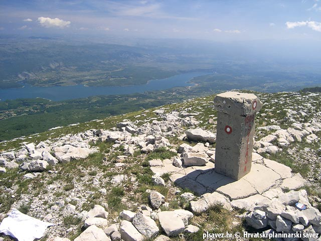

<!-- markdownlint-disable MD033 -->

<figure class="figure">
    
</figure>

Velika Milešina je naselje u općini Muć, u Splitsko-dalmatinskoj županiji.Naselje se nalazi sjevero-zapadno od Male Milešine.Naselja pod imenom Mala Milešina i Velika Milešina iskazuju se od 1910. Do 1900. iskazivano je naselje pod imenom Milešine. Za to bivše naselje sadrži podatke u navedenom razdoblju.
