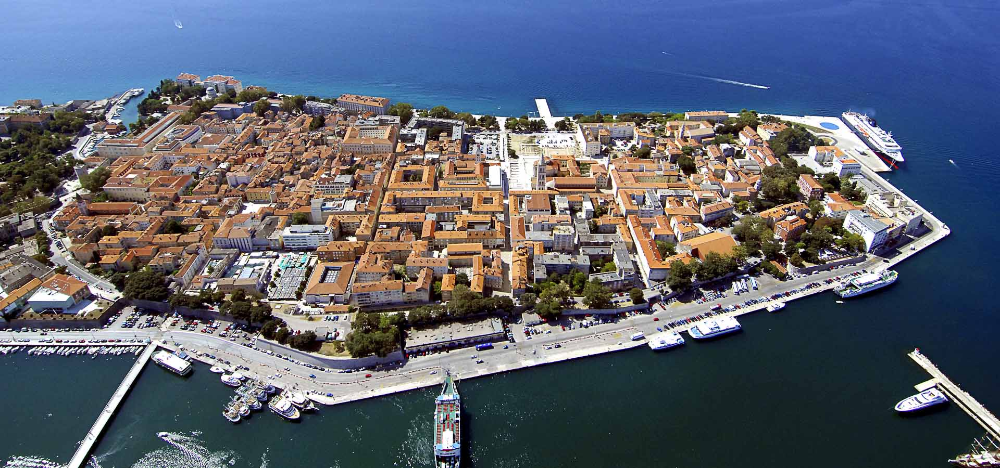

<!-- markdownlint-disable MD033 -->

<figure class="figure">
    
</figure>

Zadar je hrvatski grad na Jadranskom moru, središte Zadarske županije i šireg regionalnog kompleksa sjeverne Dalmacije i Like, unutar europske NUTS 2 regije Jadranske Hrvatske. Po broju stanovnika drugi je grad u Dalmaciji, a šesti u Republici Hrvatskoj.U sastavu naselja Zadar nalaze se 22 mjesna odbora (četvrti), a Grad Zadar, kao upravno teritorijalnu jedinicu čini osim Zadra još 14 naselja, ukupno 15 (stanje 2011). To su: Babindub, Brgulje, Crno, Ist, Kožino, Mali Iž, Molat, Olib, Petrčane, Premuda, Rava, Silba, Veli Iž, Zadar i Zapuntel.Mnoge su znamenitosti koje se mogu vidjeti u Zadru, zbog njegove duge povijesti koja seže do antičkih vremena. Neke od znamenitosti su: Crkva Sv. Donata, Forum, Kalelarga , Crkva Sv. Stošij, morske orgulje i mnoge druge.
