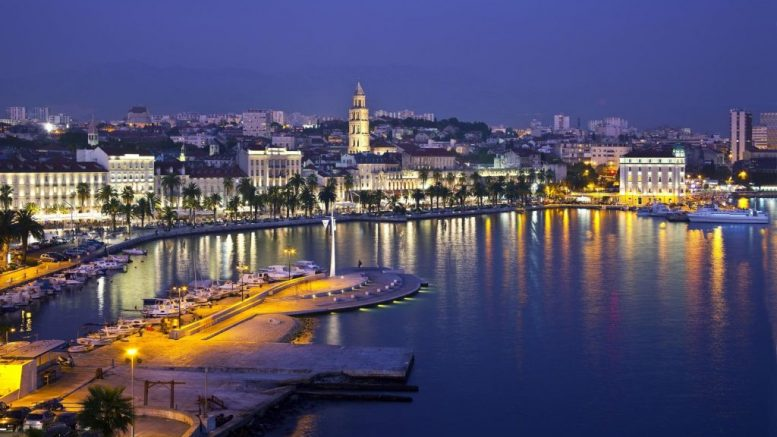

<!-- markdownlint-disable MD033 -->

<figure class="figure">
    
</figure>

Split je najveći grad u Dalmaciji, a drugi po veličini grad u Hrvatskoj.

Prema posljednjem popisu stanovništva, provedenom 2011. godine, Split ima 178.192 stanovnika, druga je po veličini hrvatska luka i treća luka na Sredozemlju po broju putnika. Upravno je središte Splitsko-dalmatinske županije i gravitira mu područje triju najjužnijih hrvatskih županija (nekadašnja Zajednica općina Split), te dio Hercegovine, pa i Bosne. U luci Lori na sjevernoj strani poluotoka nalazi se sjedište Hrvatske ratne mornarice. Gradsko središte čini starovjekovna Dioklecijanova palača iz 4. stoljeća (pod UNESCO-vom zaštitom od 1979. godine), što je jedinstven primjer u svijetu.

Split je gospodarsko i kulturno središte Dalmacije.

Pretpostavlja se da je na području današnjeg središta grada još u antici postojalo naselje Aspalathos/Spalatos (grč.). Podrijetlo njegova imena se izvodi od biljke brnistre (žuke, lat. Calicotome villosa) koja ovdje raste u izobilju. Grčki naziv za nju je aspalathos (ασπάλαθος).

U srednjovjekovnim latinskim ispravama i velikom broju dokumenata grad se naziva Spalatum, a talijanska izvedenica imena je Spalato. Hrvatsko ime grada bilo je Split, a tijekom 19. stoljeća u službenim se dokumentima hiperijekaviziralo u Spljet, da bi potom opet bilo promijenjeno u današnje ime grada.

Po drugoj teoriji, koju navodi Toma Arhiđakon ime grada je nastalo od latinske riječi za Dioklecijanovu palaču (palatium = S-palatium).

Druga zabilježena imena su: Spalatrum, Spalathron, Spalantum, Spaleta, Spalat, Spalatro.
