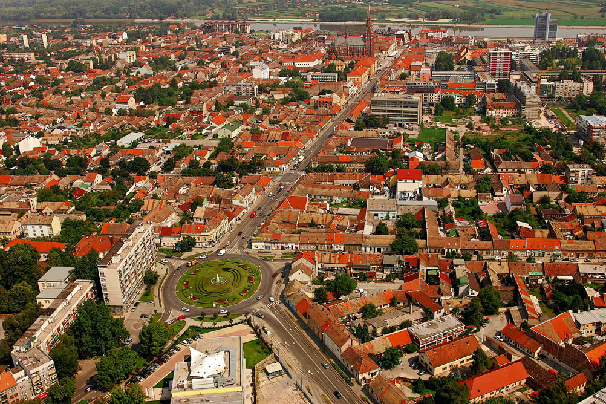

<!-- markdownlint-disable MD033 -->

<figure class="figure">
    
</figure>

Osijek je grad u istočnoj Hrvatskoj. Smješten je u ravnici na desnoj obali rijeke Drave između 16-og i 24-og kilometra od ušća u Dunav.

Najveći je grad u Slavoniji, četvrti po veličini grad u Hrvatskoj, te je industrijsko, upravno, sudsko i kulturno središte Osječko-baranjske županije.

Osijek čini 7 gradskih četvrti: Tvrđa (stari grad, izgrađen većinom u 18. stoljeću), Gornji grad, Donji grad, Novi grad (uključujući naselje Sjenjak), Industrijska četvrt, Retfala i Jug II.

Osijek je grad s najviše zelenila i zelenih površina u Hrvatskoj; na području grada nalazi se 17 parkova u ukupnoj površini od 394.000 m².

U samome naselju Osijeku živi 84.104 stanovnika, a na području administrativnoga Grada Osijeka 108.048 stanovnika (Popis stanovništva iz 2011. godine).

Prema podatcima o nacionalnosti iz 2011. god. 96.746 (89,54 %), stanovnika Osijeka su Hrvati; 6.751 (6,25 %) Srbi; 979 (0,91 %) Mađari; 263 (0,24 %) Nijemci i dr.

Osijek ima jedanaest katoličkih župa: sv. Petra i Pavla (Gornji Grad - Osijek 1), sv. Mihaela Arkanđela (Tvrđa - Osijek 2), Preslavnog Imena Marijina (Donji Grad - Osijek 3), sv. Obitelji (Jug 2 - Osijek 4), sv. Josipa Radnika (Industrijska četvrt - Osijek 5), Uzvišenja Sv. Križa (Retfala - Osijek 6), sv. Leopolda Bogdana Mandića (Osijek 7), sv. Osječkih mučenika (Tvrđavica - Osijek 8), sv. Ćirila i Metoda (Sjenjak - Osijek 9), Mučeništva sv. Ivana Krstitelja (Brijest - Osijek 10) i sv. Luke Evanđeliste (Josipovac - Osijek 11), jednu evangelističku, dvije pravoslavne parohije, Evanđeoski teološki fakultet, Židovsku općinu, muške samostane franjevaca Reda manje braće (OFM) u Tvrđi i franjevaca kapucina (OFMCAP) u Gornjem gradu te rezidenciju Družbe Isusove također u Gornjem gradu.
