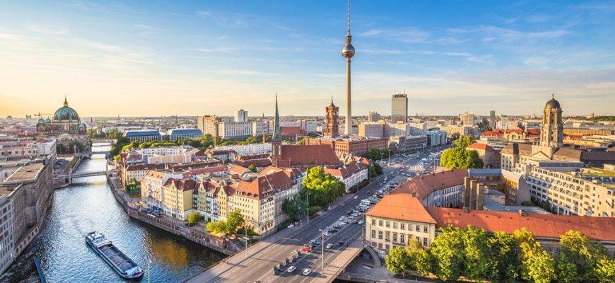

<!-- markdownlint-disable MD033 -->

<figure class="figure">
    
</figure>

Berlin je s više od 3,5 milijuna stanovnika najveći i glavni grad Njemačke i nakon Londona drugi najveći grad Europske unije. Prije Drugog svjetskog rata imao je 4,5 milijuna stanovnika, a u vrijeme Hladnog rata od 1949. do 1990. bio je podijeljen na Istočni Berlin i Zapadni Berlin.

Berlin je smješten na rijekama Spree i Havel na sjeveroistoku Njemačke. Jedna je od 16 njemačkih saveznih zemalja, sa svih strana okružen saveznom zemljom Brandenburg.

Danom njemačkog ujedinjenja 3. listopada 1990. godine jedinstveni Berlin postao je jedna od 16 njemačkih saveznih pokrajina i jedna od tri savezne pokrajine koja je ujedno i grad (uz Hamburg i Bremen).

Bivši Zapadni Berlin bio je de facto enklava Zapadne Njemačke unutar Istočne Njemačke i imao je neke ovlasti savezne pokrajine, ali je formalno i vojno ostao pod upravom zapadnih saveznika; SAD-a, Velike Britanije i Francuske, i de jure nije bio dio Zapadne Njemačke. Istočni Berlin je od 1949. do 1990. godine bio glavni grad Istočne Njemačke, što je bilo protivno dogovoru četiriju savezničkih sila.

Berlinom upravlja Senat Berlina koji se sastoji od gradonačelnika i 8 senatora koji imaju zastupnički status. Gradonačelnik je predstavnik države Berlin. Zakonodavnu vlast u gradu-pokrajini vrši Zastupnički dom (Abgeordnetenhaus).
