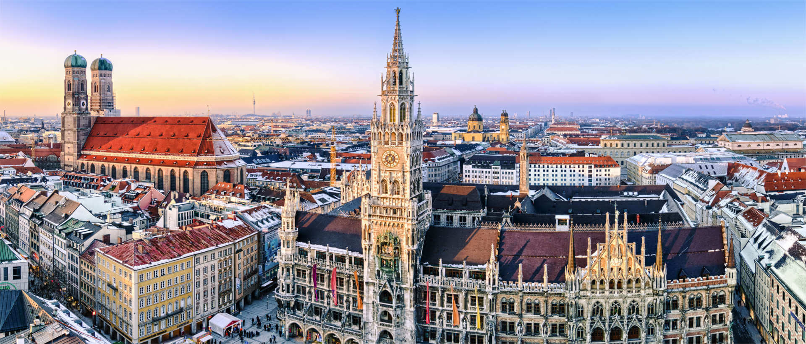

<!-- markdownlint-disable MD033 -->

<figure class="figure">
    
</figure>

München (Zemaljski glavni grad München, (njem.): Landeshauptstadt München, bavarski: Landeshaptstod Minga, slovenski Monakovo), glavni grad savezne pokrajine Bavarske. Nakon Berlina i Hamburga, po broju je stanovnika treći grad u Njemačkoj te slovi za jedno od najvažnijih gospodarskih, prometnih i kulturnih središta države. Svetac zaštitnik grada Münchena je sv. Benno.

München je međunarodno poznat po svojoj zbirci stare i klasične umjetnosti. Tako na primjer Stara i Nova pinakoteka kao i Pinakoteka moderne uz Lenbachhaus spadaju u svjetski najpoznatije umjetničke muzeje. Njemački muzej dijelom s jedinstvenim tehničkim izlošcima koje godišnje posjeti više od milijun posjetitelja spada u najposjećenije muzeje Europe. Ali i druge zbirke spadaju među najpoznatije u Njemačkoj, kao Etnološki muzej (Völkerkundemuseum), Arheološka državna zbirka (Archäologische Staatssammlung), Münchenski gradski muzej na trgu Svetog Jakova. Nadalje, u centru su još i Bavarska državna opera, Bavarsko državno glumište koje ima svoju glavnu pozornicu u nekadašnjem Rezidencijalnom kazalištu kao i Münchenske komorne igre koje su jedan od vodećih ansambala na njemačkom govornom području. Međuregionalno su poznate i druge kulturne priredbe, kao što su Operne svečane igre i Filmski festival. Poznati Münchenski Oktoberfest na livadi Theresienwiese je najveća narodna zabava, a posjećuju ju turisti iz cijelog svijeta. U lipnju se održava manifestacija Bennofest, koja se održava uz blagdan sv. Benna, zaštitnika grada Münchena.
