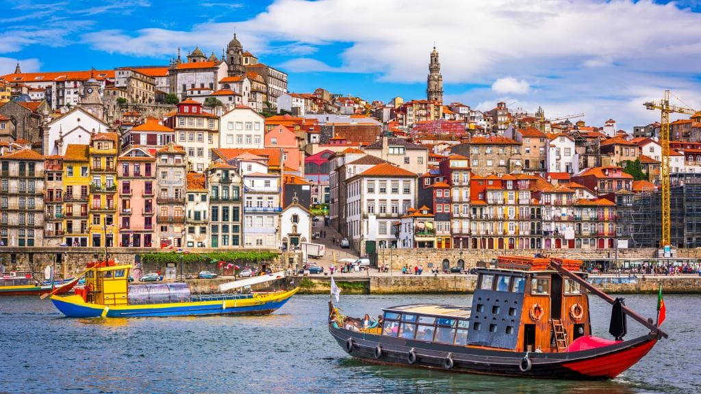

<!-- markdownlint-disable MD033 -->

<figure class="figure">
    
</figure>

Porto (portugalski: o Porto = luka, engleski: Oporto) je drugi po veličini portugalski grad. U 15 gradskih župa na 41.66 km², 2005. godine, živjelo je 238,465 stanovnika.

Porto ima izvrsno očuvanu staru gradsku jezgru unutar zidina iz 14. stoljeća, koja je upisana na popis svjetske baštine UNESCO-a kao primjer izvrsno sačuvane jezgre europskog grada koji se razvijao u duhu Zapada, ali i jasnim vezama sa Istokom. U Starom gradu ističu se romanička katedrala, najstarija građevina u gradu iz 5.-6. st., obnovljena od 1110.-13. st. Od ostalih crkava značajne su: predromanička Crkva sv. Martina u Cadofeiti (Igreja de São Martinho de Cedofeita, 10. st.), gotička Crkva sv. Franje (Igreja de São Francisco) i Crkva sv. Klare (Santa Clara) u originalnom portugalskom manuelinskom stilu, te Crkva Milosrđa (Misericórida). Značajna je barokna crkva Igreja dos Clérigos ("Crkva klerika") talijanskog arhitekta Nicolaua Nasonija, izgrađena od 1732.-63., čiji je toranj postao simbolom grada.

U Portu su znamenite i brojne palače od kojih se ističu neoklasicističke Palača burze (Bolsa do Porto, 1834.) i Kristalna palača (Palácio de Cristal), te romanička Biskupska palača (Paço Episcopal do Porto) koja je u 18. stoljeću obnovljena u stilu rokokoa.

Najvažnija obrazovna institucija u gradu bila je Nautička škola (Aula de Náutica) iz 1762. godine. Od obrazovnih institucija najveća je Sveučilište u Portu (Universidade do Porto), koje je i najveće portugalsko sveučilište s oko 28,000 studenata.

Porto je poznat i kao "Grad mostova", Porto nije sačuvao niti jedan stari most. Najstariji sačuvani most koji spaja dvije riječne obale, željeznički most Ponte D. Maria, projektirao je 1876. godine Gustave Eiffel. Starim gradom dominira most Ponte Dom Luís I koji je izgrađen od 1881.-86. godine.

Postoje brojni muzeji i galerije, od kojih su najpoznatiji muzej portugalske umjentosti od 16. do 20. st., Museu Nacional de Soares dos Reis, i Muzej suvremene umjetnosti (Museu de Arte Contemporânea) fundacije Serralves. Od kulturnih dvorana najpoznatije su koncertna dvorana Coliseu do Porto, Nacionalno kazalište São João, Kazalište Rivoli, Kino Batalha Značajna je moderna koncertna dvorana Casa de Música (2001.-2005.) koju je izgradio nizozemski arhitekt Rem Koolhaas kada je Porto proglašen za europski glavni grad kulture.
