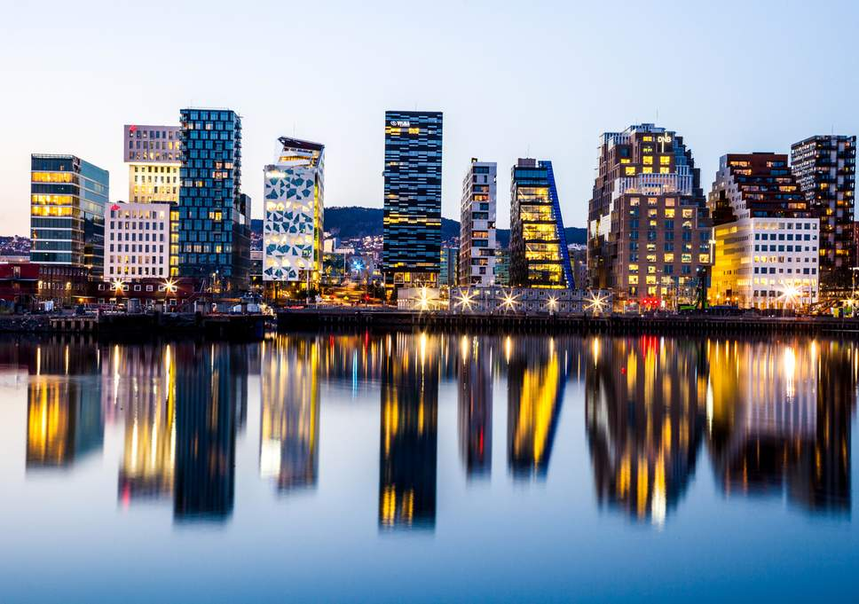

<!-- markdownlint-disable MD033 -->

<figure class="figure">
    
</figure>

Oslo je glavni grad Norveške, ima 590.041 (1.403.268) stanovnika (2008.) i prostire se na površini od 426 km². Oslo se nalazi na rubu istoimenog fjorda.

Oslo zauzima luk sjevernog dijela Oslofjorda. Fjord, koji je skoro presječen poluotokom Nesodden nasuprot Osla, leži prema jugu; s druge strane Osla prostiru se Zelena brda i planine. U granicama grada postoji 40 otoka od kojih je najveći Malmøya i 343 jezera, najveće je Maridalsvannet, koji je i najveći izvor pitke vode za zapadni dio Osla. Iako je populacija mala s obzirom na druge europske metropole, zauzima veliki prostor jer gradski prostor nije skučen i podignut u visinu. Unutar grada nalaze se mnogi parkovi i otvoreni prostori, stvarajući prozračno i zeleno ozračje.
