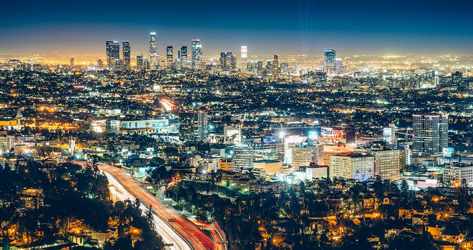

<!-- markdownlint-disable MD033 -->

<figure class="figure">
    
</figure>

Los Angeles (engleski izgovor IPA: /lɒs ˈændʒələs/ los-AN-jə-ləs; španjolski izgovor: [los ˈaŋxeles]), poznat i pod skraćenicom L.A., grad je smješten uz obalu Tihog oceana na jugu američke savezne države Kalifornije. Prema popisu stanovništva iz 2006. u samom gradu je živjelo 3,849.378 stanovnika, što ga čini najvećim gradom u Kaliforniji i nakon New Yorka drugim najnaseljenijim gradom u SAD-u. Njegovo ime na španjolskom jeziku znači anđeli.

Los Angeles je i sjedište okruga Los Angeles, koji je 2005. imao populaciju od 10.226.506, što ga čini najnaseljenijim okrugom u SAD-u, a cijelo metropolitansko područje grada iste je godine imalo 17,545.623 stanovnika, čime je jedno od najvećih metropolitanskih područja na svijetu.

Los Angeles je poznat kao jedan od najvažnijih svjetskih gospodarstvenih, kulturalnih i zabavnih centara. U gradu se nalaze brojna sveučilišta, znanstvene institucije, kazališta i muzeji. Los Angeles je središte filmske i televizijske industrije koja je smještena u njegovom predgrađu Hollywoodu, a uz to je i važno središte glazbene scene kao i industrije zrakoplova i svemirskih letjelica. Grad je osim toga dvaput bio i domaćin Olimpijskih igara koje su se u njemu održavale 1932. i 1984. godine.
