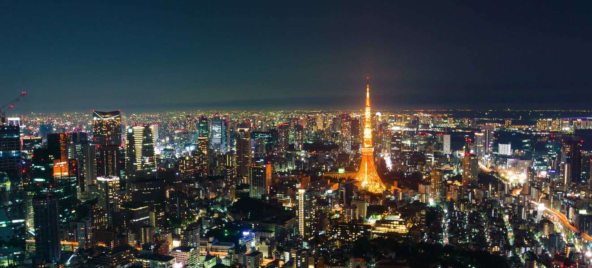

<!-- markdownlint-disable MD033 -->

<figure class="figure">
    
</figure>

Tokio (japanski: 東京, engleski: Tokyo) glavni je i najveći grad Japana te važna luka. S 13,010.280 (2010.) stanovnika jedan je od najmnogoljudnijih gradova na svijetu. Tokio s Yokohamom, Kawasakijem, Chibom i Saitamom čini metropolitansko područje Veliki Tokio s populacijom od preko 35 milijuna stanovnika što ga čini najvećim metropolitanskim područjem na svijetu, a zauzima puno površine u područjima oko njega. Tokio je danas toliko velik grad da mu se ne znaju granice.

Tokio je centar japanske i azijske trgovine te industrije.

Leži u Tokijskom zaljevu, na srednjem dijelu istočne obale otoka Honshu, na ušću rijeke Sumida. Glavni dijelovi Tokija su Ginza, Shinjuku i Odaiba.
