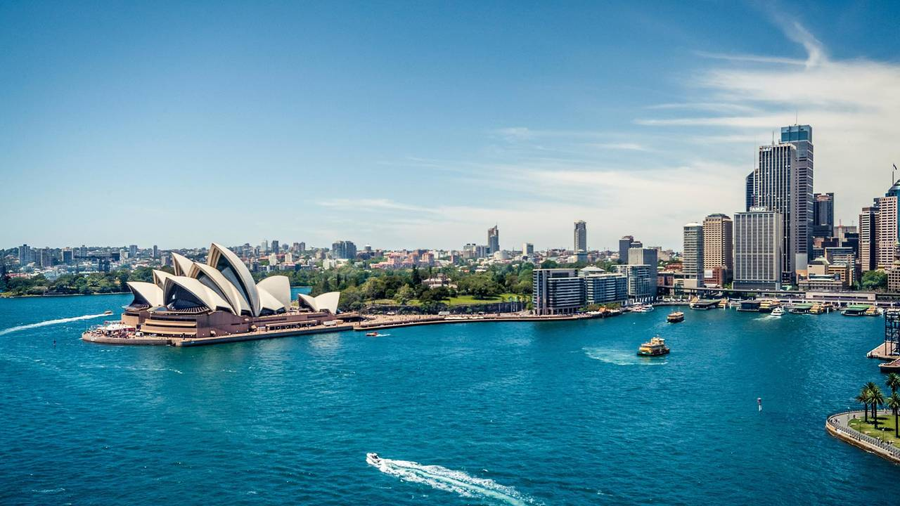

<!-- markdownlint-disable MD033 -->

<figure class="figure">
    
</figure>

Sydney je najmnogoljudniji i najstariji grad u Australiji, osnovan 1788. godine. Na administrativnom području Sydneya živi oko 4,1 milijun stanovnika, dok uža gradska jezgra (City of Sydney) broji samo 168.682 stanovnika.[1]

Sydney je glavni grad australske savezne države New South Wales. Financijski, prometno, kulturno, znanstveno i gospodarski Sydney je, uz Melbourne, jedan od dva najvažnija grada u Australiji. U njemu su se 2000. godine održale XXVII. Olimpijske igre, a bio je i domaćinom Svjetskog dana mladih 2008. godine. Grad je također omiljeno turističko odredište, zbog svojeg lijepog položaja, plaža i klime mnogo je puta biran kao najbolje odredište za život ili odmor.

Sydneyska opera danskog arhitekta Jørna Utzona najpoznatija je sydneyska zgrada, po kojoj je grad prepoznatljiv širom svijeta. Sagrađena je u ekspresionističkom stilu i uvrštena na listu Svjetske baštine UNESCO-a. Druga je svjetski poznata znamenitost most preko luke (Harbour Bridge), arhitekta Ralpha Freemana. Grad ima tri botanička vrta, od kojih je najpoznatiji Royal Botanic Gardens. Toranj Sydney Tower je s 305 m drugi po visini u Australiji i treći na južnoj Zemljinoj polutci.

Kip kraljice Viktorije ispred istoimene zgrade
Najvažnija crkva u Sydneyu je katolička katedrala posvećena svetoj Mariji. Prvi katolički svećenici, Irci John Therry i Phillip Conolly, stigli su u koloniju u svibnju 1820. godine. Kamen temeljac za kapelu posvećenu Majci Božjoj položen je godinu kasnije. Godine 1835. imenovan je prvi katolički biskup i crkva je postala katedrala, a 30 godina kasnije sasvim je izgorjela. Nadbiskup Polding položio je kamen temeljac za novu crkvu 1868. Arhitekt je bio William Wardell (prethodno projektirao St. John's College), a građevina je bila u neogotičkom stilu sa šiljasto zaobljenim prozorima te vanjskim i unutarnjim kontraforima. Nedovršena crkva posvećena je 1905., a 23 godine kasnije potpuno dovršena. Godine 1930. papa Pio XI. dodijelio joj je status basilica minor, a Pavao VI. propovijedao je u njoj četrdeset godina kasnije. Ivan Pavao II. posjetio ju je dvaput. Crkva je sagrađena od australskog pješčanika, ima pročelje s dvostrukim tornjevima koji su visoki 74.5 m. Toranj iznad križišta niži je za oko 30 m, a građevina je duga 107 m. U unutrašnjosti je uobičajeno visoka dvorana s galerijama s arkadama, a pod je prekriven mozaicima. Jedna od kapela posvećena je irskim svecima. Svjetlost ulazi kroz šareno obojene staklene prozore. Glavni oltar je od mramora, a među kipovima je oličena Madona koja je vrlo elegantna i očaravajuća. U kripti je pokopan katolički biskup Sydneya.
