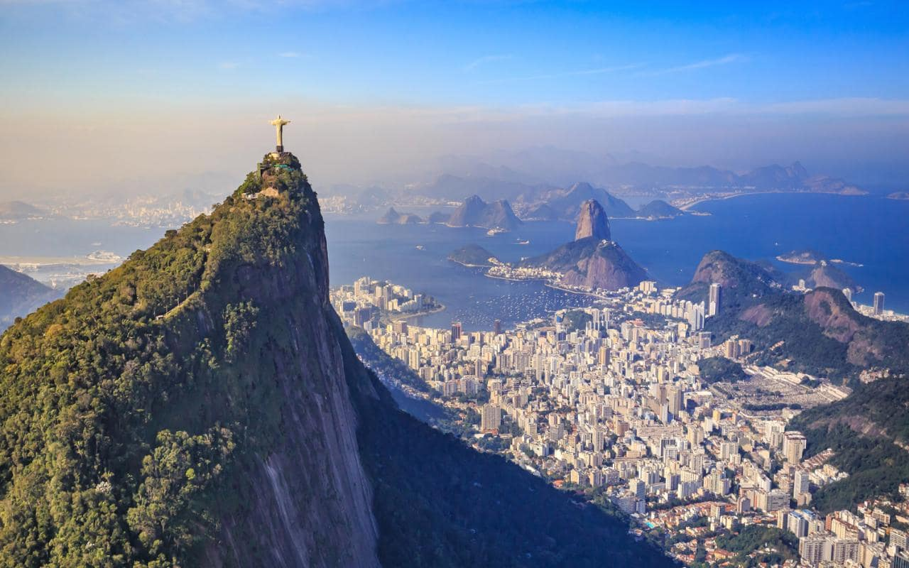

<!-- markdownlint-disable MD033 -->

<figure class="figure">
    
</figure>

Rio de Janeiro (Siječanjska rijeka na portugalskom) je ime grada u državi Rio de Janeiro u jugoistočnom Brazilu. Rio de Janeiro je bivši glavni grad Brazila (od 1763. do 1960.) i Portugalskog Carstva (od 1808. do 1821.). Spektakularno prirodno okruženje, karnevali, samba i plaže kao što su Copacabana, Ipanema i Leblon su ono po čemu se prepoznaje Rio. Ipak, najpoznatija atrakcija i zaštitni znak grada je sigurno statua Isusa, poznata kao Cristo Redentor na brdu Corcovado. Međutim, tu su i brdo Šećerna Glava sa žičarom koja ide do njegovog vrha, zatim Sambodrom za vrijeme karnevala, kao i stadion Maracanã, jedan od najvećih na svijetu. Rio također posjeduje i dvije najveće šume u urbanom području, Floresta da Pedra Branca i Floresta da Tijuca.

Procjena broja stanovnika u gradu za 2005. godinu je 6.094.183, a u širem krugu grada je procijenjeno da živi između 11 i 12 milijuna stanovnika. Ipak, Rio nije najveći grad u Brazilu, ali je odmah iza São Paula. Ljude iz Rio de Janeira zovu Carioce, a neslužbena himna grada je Cidade Maravilhosa - Čudesan Grad.

Dana 1. srpnja 2012. godine, područje Rio de Janeira od najviših vrhova Nacionalnog parka Tijuca do mora, uključujući botaničke vrtove iz 1808. godine, planinu Corcovado sa slavnom skulpturom Krista Iskupitelja, te brda iznad zaljeva Guanabara uključujući opsežan urbani krajolik duž uvale Copacabana upisano je na UNESCO-v popis mjesta svjetske baštine u Americi. Naime, UNESCO je ovo područje prepoznao zbog jedinstvenog smještaja u prirodi koji je oblikovao razvoj grada, te mjesto koje je snažno inspiriralo umjetnike, od glazbenika, urbanista i dizajnera krajolika.

God. 2017. kao svjetska baština UNESCO-a upisano je i Valongo pristanište iz 1811. god., arheološki lokalitet u samom središtu grada, uključujući trg Jornal do Comércio, čiji je najstariji sloj „najvažniji fizički trag dolaska afričkih robova na američko tlo”.
