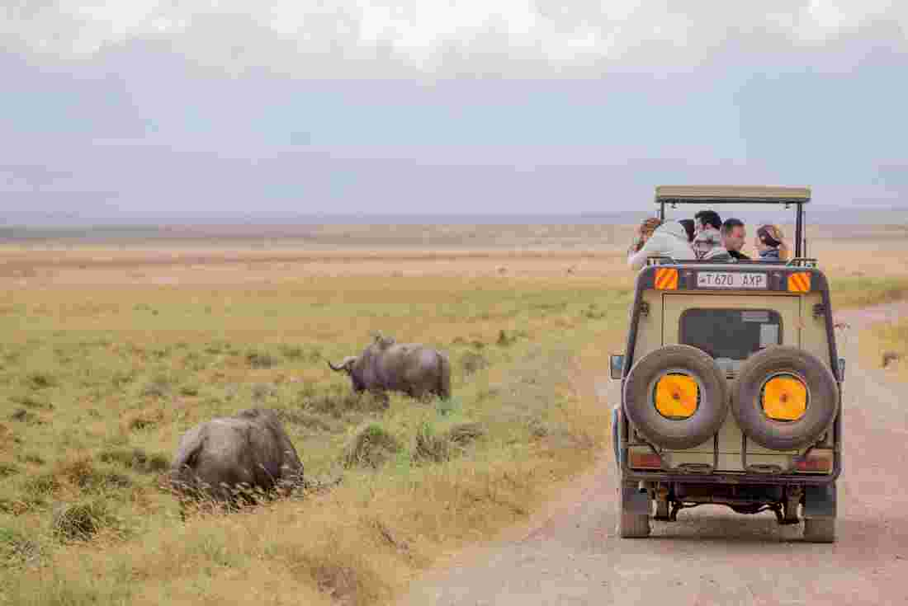

<!-- markdownlint-disable MD033 -->

<figure class="figure">
    
</figure>

Safari (na svahili jeziku znači putovanje) je pojam, koji označava turistički pohod preko teritorija Afrike s razgledavanjem prirode.

Nekada se safari uglavnom odnosio na lov na velike životinje i ostalu divljač. Međutim, danas se taj naziv više koristi za obilazak prirode i životinja u njihovom prirodnom okruženje uz fotografiranje. Za safari je specifična i odjeća, koja podrazumijeva (visoke) pustinjske pohodne cipele, kaki boja odjeće, safari jaknu i široku kapu, koja štiti od jakog sunca.

William Cornwallis Harris predvodio je ekspediciju s ciljem promatranja i bilježenja divljeg životinjskog svijeta, 1836. godine. Harris je utemeljio safari stil putovanja. Prvi roman Julesa Vernea „Pet tjedana u balonu“ objavljen 1863. godine i prvi roman H. Ridera Haggarda „Rudnici kralja Solomona“ obavljen 1885. godine, opisali su putovanja engleskih putnika na safariju. Postali su popularni i kasnije su potaknuli razvoj literature i filmova o safariju.

Safari je rasprostranjen u državama kao što su: Tanzanija, Kenija, Bocvana, Zambija, Namibija, Uganda, Južnoafrička Republika, Demokratska Republika Kongo i Zimbabve. Postoje razne vrste safarija, kao što su: mobilni safari, safari s vodičem, leteći safari, safari na konju ili slonu, riječni safari, ekološki safari i dr.
