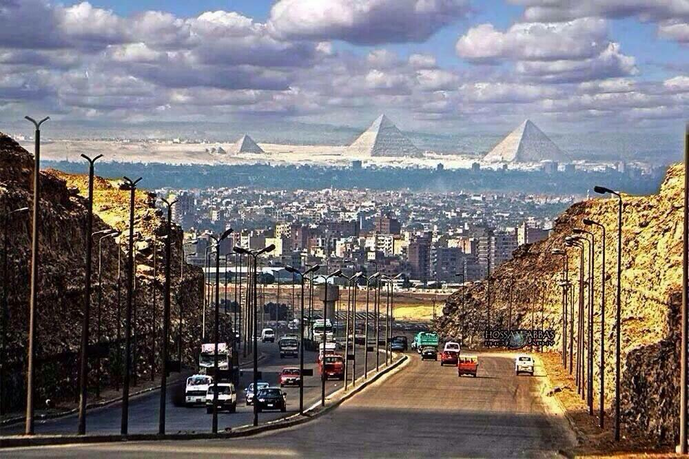

<!-- markdownlint-disable MD033 -->

<figure class="figure">
    
</figure>

Kairo (arapski: القاهرة) je glavni grad Egipta. Procjenjuje se da njegova aglomeracija iznosi 15,2 milijuna stanovnika i po tome je trinaesti grad po veličini u svijetu.

Dok je al-Qāhirah službeno ime grada, u lokalnom govoru se on obično naziva imenom same države Mişr na lokalnom dijalektu se izgovara Maşr. Ime al-Qāhirah znači "onaj koji potčinjava / onaj koji svladava". Ovo ime je dodijeljeno zbog toga što su mnoge vojske kroz povijest pokušale osvojiti grad i njegovi branitelji bi ih uništili, ili borci poslani iz Kaira uništavali neprijateljske vojske (poznatiji osvajači bili su Mongoli, Križari i Osmanlije).

Kairo je smješten na obalama i otocima Nila u sjevernom Egiptu, malo južnije od mjesta gdje rijeka napušta svoju pustinjom obrubljenu dolinu i gdje se grana u tri rukavca započinjući deltu Nila.

Najstariji dio grada je na istočnoj strani rijeke. Novi dio se postupno širi zapadno, okružujući zelene površine doline Nila. Zapadni dijelovi su sagrađeni u doba Ismaila Veličanstvenog, po uzoru na Pariz, sa širokim bulevarima, parkovima i otvorenim prostorima. Najstariji dio na istoku je potpuna suprotnost. Rastao je nasumično kroz stoljeća i pun je uskih, zakrčenih staza. Dok zapadnim Kairom dominiraju zgrade vlade i državne zgrade u modernom stilu, istočni dio je ispunjen stotinama starih džamija koje služe kao orijentiri. Obilno korištenje vode iz Nila omogućilo je gradu da se širi ka istoku, dalje u pustinju. Mostovi povezuju Kairo s otocima Gezira i Roda, na kojima su smješteni mnogi vladini uredi i mnoge kuće vladinih službenika. Mostovi se također pružaju preko Nila, povezujući grad s predgrađima Giza i Imbabah. Najdulji most u Kairu, ali i čitavoj Africi je Most 6. listopada dugačak 22 km[1] koji spaja središte grada sa zračnom lukom.

U pustinji Zapadno od Gize je dio drevne nekropole Memphis, na platou Gize, sa svoje tri velike piramide, od kojih je jedna Keopsova piramida (jedina preostala građevina od sedam drevnih svjetskih čuda). Oko 18 kilometara južno od Kaira je smješten stari grad Memphis koji graniči s nekropolom Saqqara. Ovi gradovi su drevne prethodnice Kaira.
