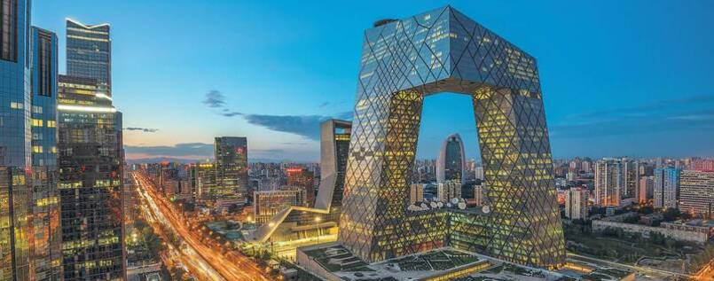

<!-- markdownlint-disable MD033 -->

<figure class="figure">
    
</figure>

Peking (kineski: 北京, pinyin: Běijīng; "sjeverna prijestolnica") je glavni grad Narodne Republike Kine (NRK) i jedna od četiri gradske oblasti pod direktnom kontrolom vlade.

Peking je drugi po veličini kineski grad (poslije Šangaja) s oko 17,4 milijuna stanovnika (računajući gradsku oblast Pekinga)[1]. Veliki je prometni centar s mnoštvom pruga, cesta i autocesta koji ulaze i izlaze iz njega u svim pravcima. Peking je također i politički, kulturni i obrazovni centar NRK, dok su Šangaj i Hong Kong veći ekonomski centri od njega. Peking je izabran za domaćina Olimpijskih igara 2008. godine.

Peking ima vrlo mnogo tradicionalnih kineskih kulturno-povijesnih znamenitosti. Najvažnija znamenitost je Zabranjeni grad, kompleks bivših carskih palača sagrađenih u tradicionalnom kineskom stilu gradnje. Ispred Zabranjenog grada je najveći svjetski trg Tiananmen (Trg nebeskog mira). Na trgu su smješteni brojni spomenici komunističke vlasti (Velika dvorana naroda, mauzolej Mao Zedonga, Kineski narodni muzej). Značajne su i ostale bivše carske palače (najpoznatija je Ljetna palača u Pekingu).

Poznati su brojni taoistički i budistički hramovi (najpoznatiji je Nebeski hram). Ostali značajni hramovi su Hram Zemlje, Hram Sunca i Hram Mjeseca. U centru grada postoje brojni parkovi s umjetnim jezerima (najpoznatiji su Beihai, Shichahai, Zhongnanhai, Jingshan i Zhongshan).

Ming grobnice u distriktu Changping su najljepši i najveći kompleks carskih mauzoleja dinastije Ming u kojemu je sahranjeno 13 careva, počevši od trećeg cara dinastije Ming, Yonglea (1402.–1424.), koji je premjestio prijestolnicu iz Nanjinga u Peking, sve do posljednjeg cara dinastije Ming, Chongzhena, koji se objesio u travnju 1644. godine.

Najveća turistička znamenitost u okolici Pekinga je ipak Kineski zid čiji se najposjećeniji dio nalazi samo oko 30 km od grada. Također je značajno nalazište Pekinškog čovjeka Zhoukoudian.
