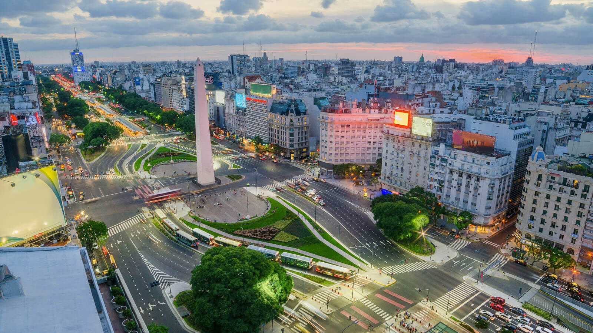

<!-- markdownlint-disable MD033 -->

<figure class="figure">
    
</figure>

Buenos Aires (špa. izgovor [ˈbwenoˈsaiɾes], hrv. Dobar zrak, službeno Ciudad de Buenos Aires ili Ciudad Autónoma de Buenos Aires) glavni je grad Argentine, a ujedno i njen najveći grad i luka te politički, ekonomski i kulturni centar zemlje. Druga najveća metropolitanska zona u Južnoj Americi nakon São Paula, smješten na južnoj obali La Plate, na jugozapadu kontinenta, grad Buenos Aires nije dio, niti je glavni grad Provincije Buenos Aires, već autonomni federalni distrikt. Veliki Buenos Aires (Gran Buenos Aires, GBA) četvrta je najveća konurbacija u Latinskoj Americi, s oko 13 milijuna stanovnika.Smatra se najbogatijim gradom Južne Amerike i južne hemisfere i "Alfa svjetskim gradom" prema popisu istraživačke grupe GaWC, sveučilišta u Loughboroughu (UK) iz 2008

Nakon unutrašnjih sukoba u 19. stoljeću, Buenos Aires je 1880. izdvojen iz provincije Buenos Aires. Granice grada proširene su radi priključenja bivših gradova Belgrano i Flores, koji su sada četvrti Buenos Airesa. U Skladu s ustavnim reformama iz 1994., grad je postao autonomno područje, te službeni naziv glasi Ciudad Autónoma de Buenos Aires (hrv. Autonomni grad Buenos Aires).

Ubraja se među najljepše gradove svijeta s arhitekturom koja kombinira utjecaje Madrida, Pariza i Barcelone (neobarok, eklekticizam, francuski neoklasicizam, Art Nouveau) s geometrijski zacrtanim planom ulica i trgova ukrašenim spomenicima, te prostranim zelenim površinama.
