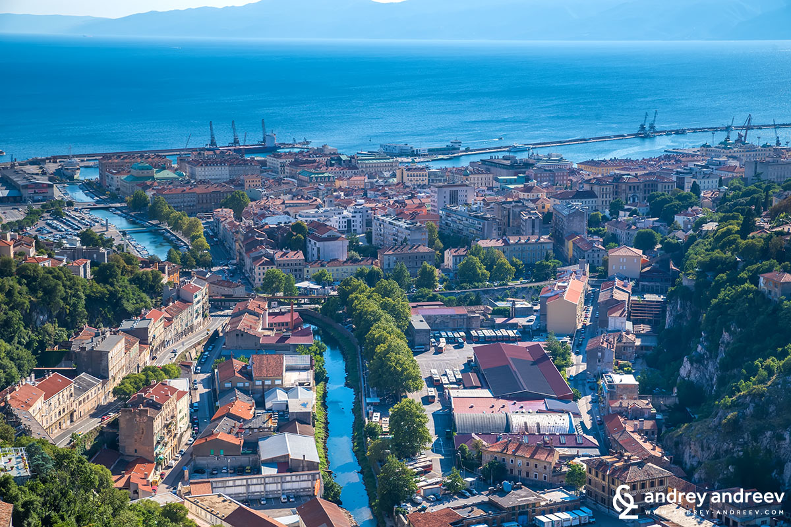

<!-- markdownlint-disable MD033 -->

<figure class="figure">
    
</figure>

Rijeka (talijanski i mađarski: Fiume, njemački: Sankt Veit am Flaum, slovenski: Reka, čakavski: Rika, Reka) najveća je hrvatska luka, treći po veličini grad u Hrvatskoj te administrativno središte Primorsko-goranske županije. Grad Rijeka s okolicom (bivša općina Rijeka – Kastav, Viškovo, Grobnik, Kostrena, Bakar, Kraljevica, Klana) ima 191.641 stanovnika. Mađarska je vlada još u 19. stoljeću zbog idealnog zemljopisnog položaja i dubine mora u Kvarnerskom zaljevu razvila Rijeku u jednu od najvećih europskih luka i moćno industrijsko središte. Rijeka je bila značajna i kao jedno od najvažnijih financijskih središta bivše Jugoslavije. Početkom devedesetih godina 20. stoljeća dolazi do propasti industrije i naglog smanjenja lučkog prometa, pa se u novom mileniju Rijeka počinje okretati razvoju turizma i uslužnog sektora.

Povijesno središte Rijeke formiralo se kraj ušća rijeke Rječine u Jadransko more. Riječki Stari grad, smješten na desnoj obali Rječine, izgubio je mnogo povijesnih zgrada, no još uvijek predstavlja živo srce grada. Ispod njegovih se ulica nalaze vrijedne arheološke iskopine te splet starih tunela. Uz južni obod Staroga grada počelo se u drugoj polovici 18. stoljeća izgrađivati danas poznato šetalište Korzo s Rivom. Krajem 19. i u prvoj polovici 20. stoljeća znatno su izgrađeni Sušak, Brajda i drugi gradski predjeli.
